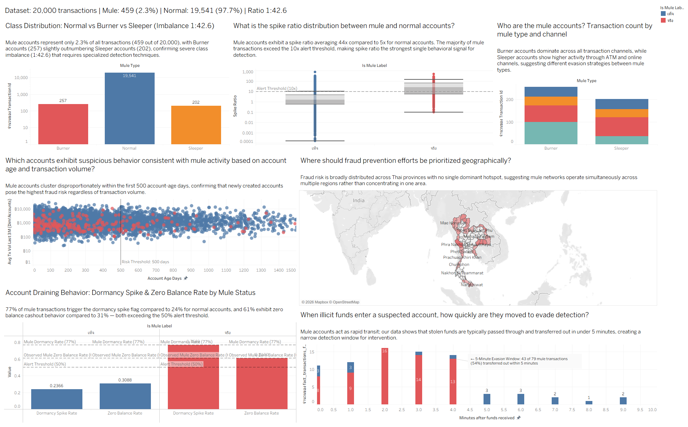
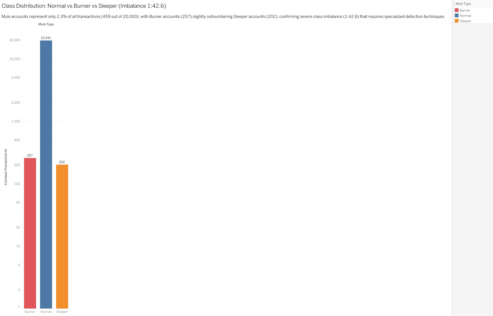
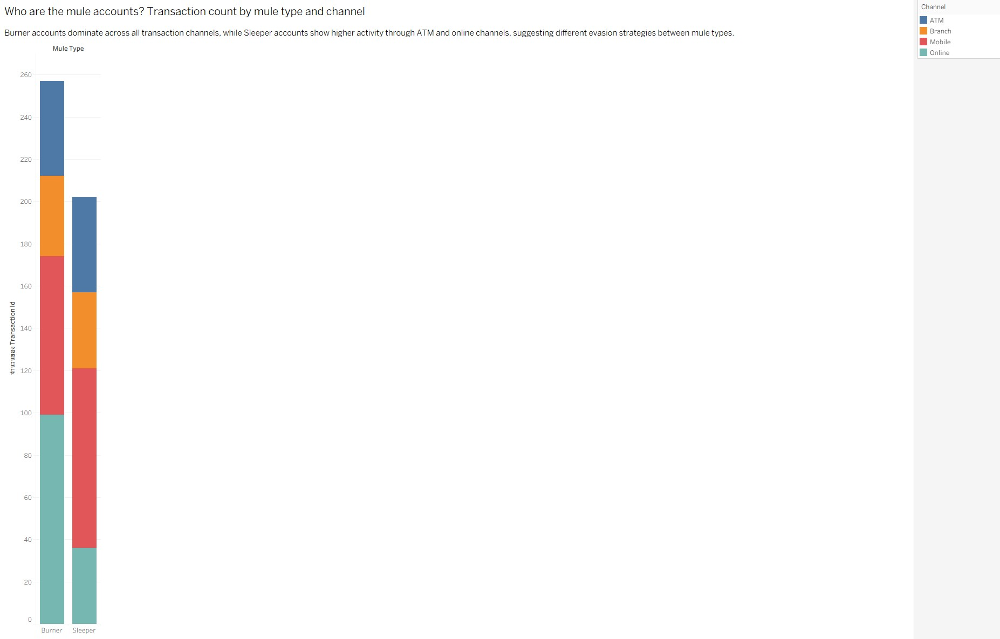
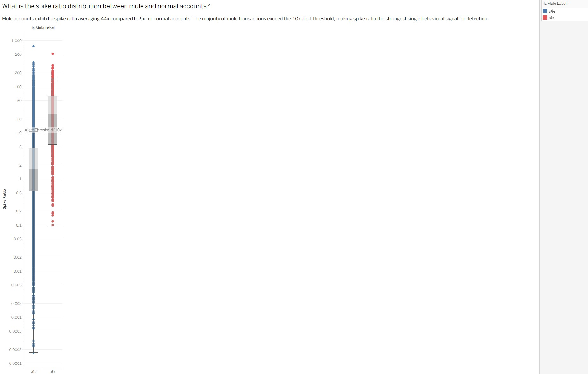
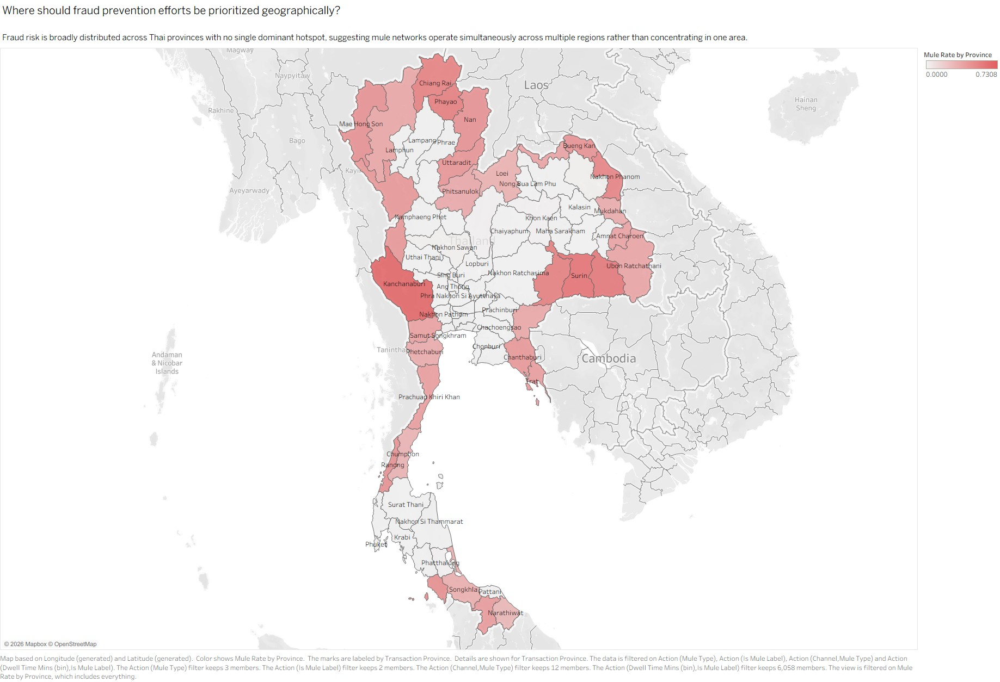
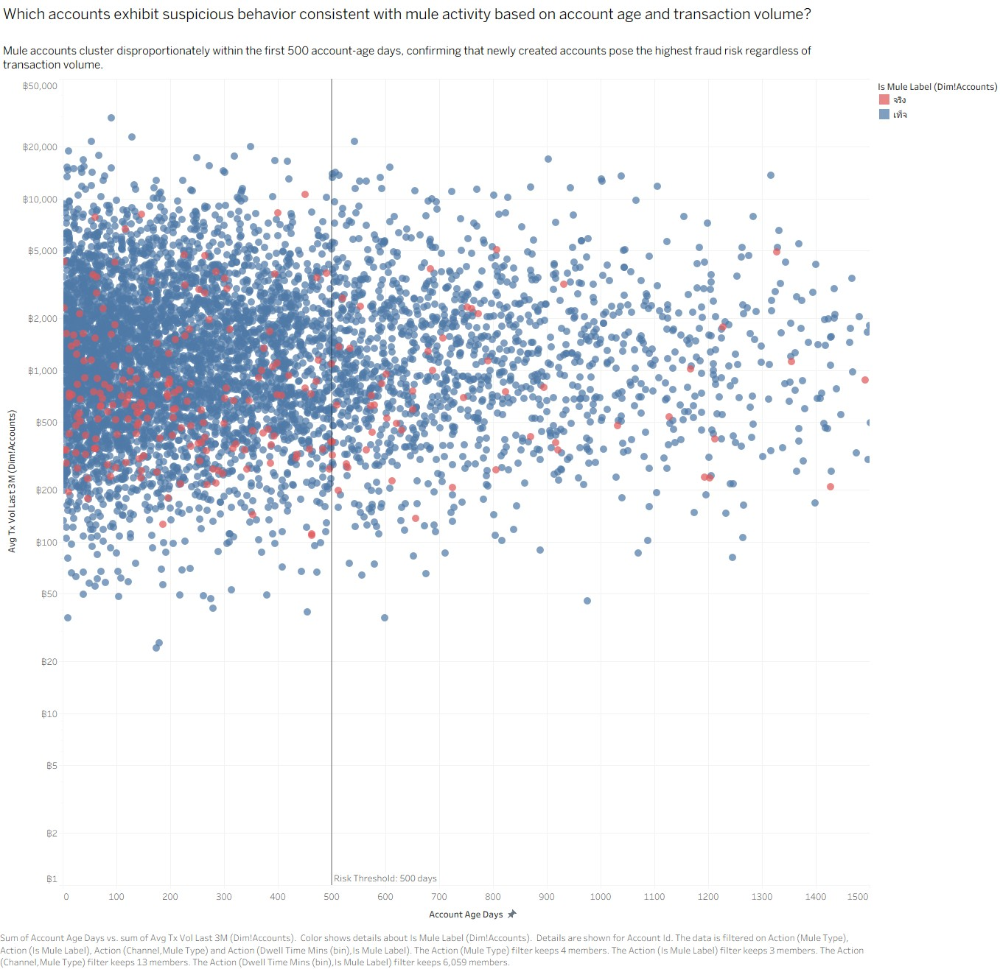
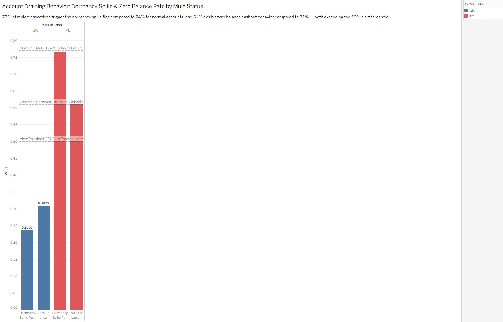
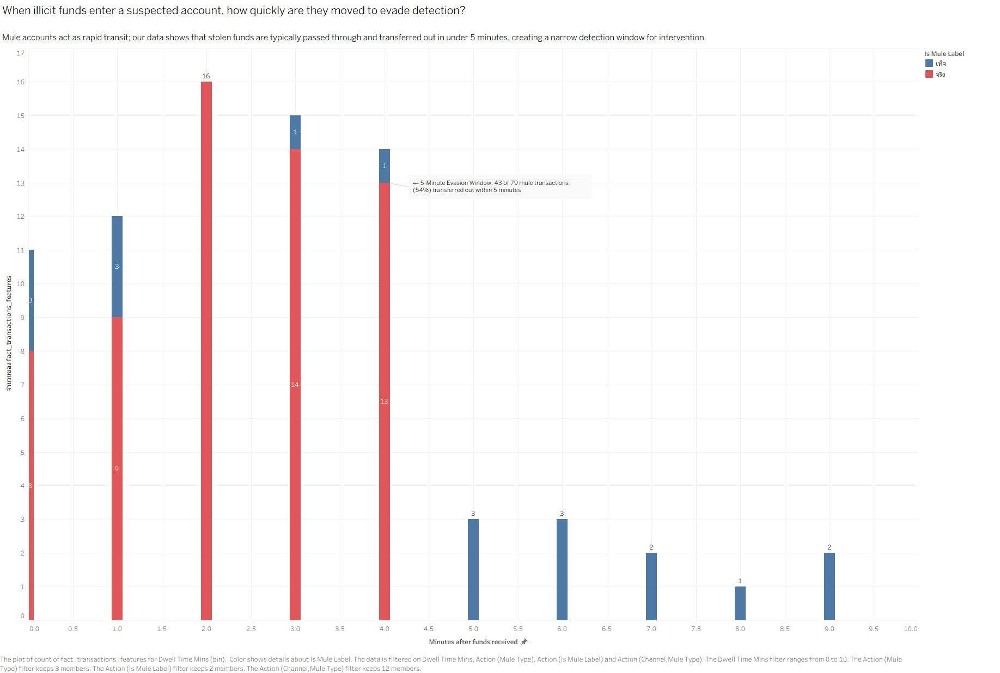

# DE471 — Mule Account Detection
Data Analytics project for detecting suspicious mule account activity in a simulated Thai retail banking environment.

**Designed by:** MTN (MUMTENGNHONG) GROUP  
**Date:** 18 January 2026  
**Course:** DE471 Data Analytics & Business Intelligence

---

## 1. Problem Statement/Background

Thailand is facing a rapid increase in **Authorized Push Payment (APP) scams**, where victims are manipulated into voluntarily transferring money. Since these transactions are initiated by legitimate customers, traditional fraud detection systems are unable to detect them effectively.

Fraudsters use mule accounts to quickly transfer funds out within minutes, leaving banks little opportunity for recovery. As banks currently operate in a reactive manner, a **proactive data analytics solution** is required to detect scam-induced mule transactions in near real-time — before funds are dispersed beyond recovery.

---

## 2. SMART Objectives / Value Propositions

**SMART Objectives:**  
The objective of this project is to develop a **Proactive Mule Account Detection Dashboard** by Q2 2026. The solution aims to detect suspicious mule account activities **within 30 minutes** using existing transaction data, achieving a **Recall of ≥80%** and a **False Positive Rate of ≤5%**, in order to support faster operational response and minimize financial losses from APP scams.

**Value Propositions:**

- **Proactive Detection:** Shift from reactive to proactive operations — flag suspicious accounts before funds are fully dispersed out of the system.
- **Faster Operational Response:** Reduce response time for the Fraud Operations team through a Near Real-Time Dashboard that surfaces the highest-risk accounts automatically.
- **AML Compliance:** Support Bank of Thailand and AMLO requirements for Suspicious Transaction Reporting (STR).

---

## 3. Questions/Hypothesis

### 5W1H Analytical Questions

**Who & What**
- How do mule accounts (Burner and Sleeper) differ from normal accounts in terms of transaction behavior?
- At what Spike Ratio threshold can a mule transaction be reliably distinguished from a legitimate high-value transfer?

**When & How**
- How quickly are incoming funds transferred out? What Dwell Time threshold identifies Rapid Transit behavior used to evade detection?
- How long do Sleeper mule accounts remain dormant before being activated for a large transaction?

**Where**
- Which regions/provinces show the highest fraud risk and concentration of mule-linked transactions?
- Does cross-province activity within 2 hours (Impossible Travel) correlate with confirmed mule labels?

**Why**
- How can identifying these behaviors reduce scam losses and enhance banking security?

### Hypothesis

Mule accounts can be detected using a combination of behavioral signals derived from existing transaction data — specifically Spike Ratio, Dwell Time, shared Device/IP usage, and geographic anomalies — without requiring additional personal data or external data sources.

---

## 4. Key Metrics/Attributes

### Engineered Features

**Account Age Days** measures the number of days since account creation. Newly created accounts (0–500 days) are disproportionately associated with mule activity, suggesting fraudsters frequently open fresh accounts to avoid detection.

**Average Transaction Volume (3-Month)** captures the baseline spending behavior of each account. A sudden spike above this baseline — quantified by the **Spike Ratio** — serves as a primary signal for abnormal activity.

**Dwell Time (Minutes)** represents the duration between receiving funds and transferring them out. Mule accounts consistently show dwell times under 5 minutes, reflecting deliberate rapid transit behavior to evade detection.

### Data Sources

This analysis draws on four core tables: customer profiles (`dim_customers`), account records (`dim_accounts`), device information (`dim_devices`), and transaction history (`fact_transactions`), comprising **20,000 simulated transactions** with realistic class imbalance.

| Table | Rows | Description |
| :--- | :--- | :--- |
| `dim_customers` | 5,000 | Customer demographics and KYC status |
| `dim_accounts` | 6,000 | Account profiles; ~4% labeled as mule |
| `dim_devices` | 2,400 | Device and OS information |
| `fact_transactions` | 20,000 | Transaction history; ~5% fraud rate |

---

## 5. Data Dictionary

### `dim_customers`

| Column | Data Type | Description | Values / Range |
| :--- | :--- | :--- | :--- |
| **customer_id** | String | Unique customer identifier | `C1xxxxx` |
| **age** | Integer | Customer age (outliers replaced with median) | 0 – 100 |
| **occupation** | String | Occupation category (nulls filled as `"Unknown"`) | Teacher, Engineer, Unemployed, ... |
| **risk_segment** | Categorical | Bank-assigned risk tier | `Low`, `Medium`, `High` |
| **kyc_status** | Categorical | KYC verification status | `Verified`, `Unverified`, `Pending` |
| **registered_province** | String | Home province — mule-linked customers skew toward high-risk border provinces | Thai provinces |

### `dim_accounts`

| Column | Data Type | Description | Values / Range |
| :--- | :--- | :--- | :--- |
| **account_id** | String | Unique account identifier | `A2xxxxx` |
| **customer_id** | String | FK → `dim_customers` | — |
| **account_status** | Categorical | Account status (standardized from dirty variants) | `Active`, `Dormant`, `Closed` |
| **account_age_days** | Integer | Account age in days — Burner mules trend toward 0–500 days | 0 – 3,650+ |
| **avg_tx_vol_last_3m** | Float | Average Transaction Volume (3-Month) in THB — very low for Sleeper mules | ≥ 0 |
| **is_mule_label** | Boolean | **Ground Truth Label** — `True` for confirmed mule accounts (~4%) | `True`, `False` |
| **mule_type** | Categorical | Mule archetype | `Burner`, `Sleeper`, `None` |

### `dim_devices`

| Column | Data Type | Description | Values / Range |
| :--- | :--- | :--- | :--- |
| **device_id** | String | Unique device identifier | `D3xxxxx` |
| **device_type** | Categorical | OS / Platform | `Android`, `iOS`, `Windows`, `macOS`, `Linux`, `Other` |
| **is_jailbroken_rooted** | Boolean | Flag for compromised devices (~8% prevalence) | `True`, `False` |

### `fact_transactions`

| Column | Data Type | Description | Values / Range |
| :--- | :--- | :--- | :--- |
| **transaction_id** | String | UUID — deduplicated during cleaning | UUID |
| **transaction_timestamp** | Datetime | Transaction datetime (30-day window) | — |
| **sender_account_id** | String | FK → `dim_accounts` (sender) | — |
| **receiver_account_id** | String | FK → `dim_accounts` (receiver) | — |
| **device_id** | String | FK → `dim_devices` | — |
| **amount** | Float | Transfer amount in THB (negative values corrected to absolute) | ≥ 0 |
| **sender_balance_after** | Float | Sender's remaining balance post-transaction | — |
| **ip_address** | String | Originating IP (nulls filled with `0.0.0.0`) | IPv4 |
| **is_vpn_or_tor** | Boolean | VPN / Tor anonymizer flag | `True`, `False` |
| **transaction_province** | String | Province where transaction originated | Thai provinces |
| **channel** | Categorical | Transaction channel | `Mobile`, `Online`, `ATM`, `Branch` |
| **impossible_travel_flag** | Boolean | **(Engineered)** Cross-province activity within 2 hours | `True`, `False` |

### Engineered Features (from `feature_engineering.py`)

| Feature | Formula / Logic | Fraud Signal |
| :--- | :--- | :--- |
| **spike_ratio** | `amount / avg_tx_vol_last_3m` | > 10x → Dormancy Spike alert |
| **is_dormancy_spike** | `spike_ratio > 10.0` | Sleeper mule activation flag |
| **is_zero_balance_cashout** | `sender_balance_after / amount < 0.02` | Full account drain pattern |
| **is_shared_device** | `distinct_accounts_per_device > 3` or `per_ip > 3` | Mule farm infrastructure |
| **dwell_time_mins** | Time delta: inbound → outbound (same account) | < 5 min → Pass-Through behavior |
| **is_pass_through** | `dwell_time_mins < 5.0` | Rapid transit / Hit-and-Run flag |
| **impossible_travel_flag** | Cross-province within < 2 hours | Geographic anomaly |

---

## 6. Repository Structure

```
DE471_Mule_account_detection/
│
├── data/
│   ├── mule_account_mock_data.xlsx      # Raw AI-generated dataset (Star Schema, 4 sheets)
│   ├── mule_data_cleaned.xlsx           # Post-cleaning dataset
│   └── mule_data_features.xlsx          # Feature-engineered dataset (EDA/model-ready)
│
├── notebooks/
│   └── EDA_Mule_Detection.twbx          # Tableau Workbook — 5W1H EDA visualizations
│
├── src/
│   ├── data_gen.py                       # Synthetic dataset generator (20,000 transactions)
│   ├── data_clean.py                     # Data cleaning pipeline
│   └── feature_engineering.py           # Behavioral feature engineering (7 fraud signals)
│
├── presentation/
│   └── Project Canvas MTN GROUP.pptx    # Project Canvas slide deck
│
├── images/                              # EDA chart exports for README
│
└── README.md
```

---

## 7. Data Cleaning Process

The raw dataset was intentionally generated with dirty data to simulate a real banking environment. The cleaning pipeline applied the following rules:

### 1. `fact_transactions`
- **Duplicate Rows:** Detected and removed using `transaction_id` as the deduplication key (3 duplicate rows removed)
- **Negative Amount:** Corrected negative amounts to their absolute values — preserving the transaction record and its fraud signal
- **Null IP Address:** Filled with `0.0.0.0` instead of dropping the row — to avoid destroying fraud signals embedded in those records

### 2. `dim_accounts`
- **Account Status:** Standardized inconsistent variants (e.g., `"ACT"`, `"Actv"`, `"active"`) to the canonical `"Active"` value

### 3. `dim_customers`
- **Age Outliers:** Replaced invalid ages (e.g., -5, 150) with the median — rows were retained rather than dropped, as these accounts may be mule-linked
- **Null Occupation:** Filled with `"Unknown"`

> **Key Principle:** Outliers are NOT removed. In an imbalanced fraud dataset, outliers often represent the rare fraud class. Removing them would destroy the most valuable detection signals.

---

## 8. Analysis/Model

### Exploratory Data Analysis (EDA)

The primary strategy for handling the severe class imbalance (1:42.6) in visualizations:
- **Log Scale** on the Y-Axis — makes the Minority Class (mule accounts) visible without being swallowed by the Normal Class
- **Boxplots** — reveal the distribution spread and outliers of key metrics like Spike Ratio
- **High Contrast Colors** (Blue = Normal, Red = Mule) — consistently applied across all charts to highlight the Minority Class in the foreground
- Outliers are never removed — extreme values are the fraud signal

### EDA Dashboard Overview


*Full EDA Dashboard — Dataset: 20,000 transactions | Mule: 459 (4%) | Normal: 19,541 (96%) | Ratio 1:24*

---

### Chart 1 — Who & What: Class Distribution (Imbalance 1:42.6)


*Log-scale Bar Chart showing transaction count by mule type: Burner (257), Normal (19,541), Sleeper (202)*

This chart answers **"WHO are the mule accounts?"** The severe class imbalance is immediately visible — mule accounts represent only **2.3% of all transactions** (459 out of 20,000). The 1:42.6 ratio confirms that standard detection techniques will fail, and specialized approaches such as Log Scale visualization and Imbalanced Data Handling are required. Without Log Scale, the Burner and Sleeper bars would be nearly invisible against the Normal bar.

---

### Chart 2 — Who & What: Transaction Count by Mule Type and Channel


*Stacked Bar Chart showing transaction count for Burner and Sleeper accounts broken down by channel (ATM, Branch, Mobile, Online)*

This chart answers **"WHAT channels do mule accounts use?"** Burner accounts dominate across all transaction channels, while Sleeper accounts show higher relative activity through ATM and Online channels. This divergence suggests different evasion strategies between mule types — Burner mules favor the speed and anonymity of Mobile, while Sleeper mules spread activity across channels to blend in with normal behavior patterns.

---

### Chart 3 — What: Spike Ratio Distribution (Strongest Single Behavioral Signal)


*Log-scale Boxplot comparing Spike Ratio between Normal (blue) and Mule (red) accounts, with a dashed Reference Line at the Alert Threshold of 10x*

This chart answers **"WHAT is the Spike Ratio distribution between mule and normal accounts?"** Mule accounts exhibit a Spike Ratio averaging **44x** compared to **5x** for normal accounts. The majority of mule transactions exceed the 10x alert threshold, making Spike Ratio the strongest single behavioral signal for detection. The Log Scale is essential here — on a linear axis, the extreme mule values would compress all normal values to the bottom and obscure the threshold boundary.

---

### Chart 4 — Where: Geographic Risk by Province


*Choropleth Map of Thailand showing Mule Rate by Province — darker red indicates higher mule concentration*

This chart answers **"WHERE should fraud prevention efforts be prioritized geographically?"** Fraud risk is broadly distributed across Thai provinces with **no single dominant hotspot**. This pattern suggests that mule networks operate across multiple regions simultaneously, making geographic profiling alone insufficient as a detection strategy. Border provinces such as Chiang Rai, Kanchanaburi, and Ubon Ratchathani show elevated mule rates, but the distribution confirms that behavioral signals must always accompany geographic filters.

---

### Chart 5 — Where & Who: Account Age vs. Average Transaction Volume (3-Month)


*Scatter Plot of Account Age Days (X-axis) vs. Average Transaction Volume 3-Month (Y-axis) — Red = Mule, Blue = Normal — with a vertical Risk Threshold line at 500 days*

This chart answers **"WHICH accounts exhibit suspicious behavior based on account age and transaction volume?"** Mule accounts (red dots) cluster disproportionately within the first **500 Account Age Days**, confirming that newly created accounts pose the highest fraud risk regardless of transaction volume. The scatter also shows that mule accounts span the full range of Average Transaction Volume (3-Month), proving that volume alone cannot isolate mule accounts — Account Age Days must always be combined with behavioral signals.

---

### Chart 6 — When & How: Account Draining Behavior — Dormancy Spike & Zero Balance Rate


*Bar Chart comparing Dormancy Spike Rate and Zero Balance Cashout Rate between Normal (blue) and Mule (red) accounts, with a dashed Alert Threshold line at 50%*

This chart answers **"HOW do mule accounts drain funds after receiving them?"** Both behavioral flags exceed the 50% Alert Threshold for mule accounts:
- **Dormancy Spike Rate:** Mule **77%** vs Normal **24%** — a 3.2× difference that significantly exceeds the threshold
- **Zero Balance Cashout Rate:** Mule **61%** vs Normal **31%** — confirms the account-draining pattern expected in a terminal mule node

Both signals together form the basis for an immediately implementable detection rule.

---

### Chart 7 — When: Dwell Time Distribution (The 5-Minute Evasion Window)


*Histogram of Dwell Time (minutes) after funds are received — Red = Mule, Blue = Normal — with a Reference Line marking the 5-Minute Evasion Window*

This chart answers **"When illicit funds enter a suspected account, how quickly are they moved to evade detection?"** Mule accounts act as rapid transit — **54% of mule transactions (43 out of 79) transferred funds out within 4 minutes** of receipt. The mule bars (red) cluster heavily in the 1–4 minute range, while normal accounts (blue) are distributed more evenly over longer periods. This confirms that **Dwell Time < 5 minutes** following a large inflow is a reliable, real-time-actionable detection rule.

---

## 9. Findings and Insights

### Geographic Risk
Fraud risk is broadly distributed across Thai provinces with no single dominant hotspot. This pattern suggests that mule networks operate across multiple regions simultaneously, making geographic profiling alone insufficient as a detection strategy.

### Account Profiling
Mule accounts — both Burner (257 transactions) and Sleeper (202 transactions) — are disproportionately concentrated among accounts aged **0–500 days**. Furthermore, mule accounts exhibit a Spike Ratio averaging **44x** compared to **5x** for normal accounts, indicating sudden large inflows relative to historical behavior. This confirms that transaction volume alone cannot distinguish mule accounts from legitimate ones; **multi-feature behavioral analysis is required**.

### Critical Evasion Window
A strong rapid transit pattern was observed across flagged accounts. Fraudulent funds are typically transferred out **within 5 minutes** of receipt. This narrow evasion window is further supported by:
- **77%** of mule transactions trigger the dormancy spike flag, compared to **24%** for normal accounts
- **61%** exhibit zero balance cashout behavior, compared to **31%** for normal accounts

### Summary of Key Findings

| # | Finding | Key Numbers | Implication |
| :---: | :--- | :--- | :--- |
| 1 | Severe Class Imbalance | Mule 2.3% (459/20,000) — Ratio 1:42.6 | Log Scale and Imbalanced Data Handling are mandatory |
| 2 | Spike Ratio is the strongest single signal | Mule avg 44x vs Normal 5x | Majority of mule transactions exceed the 10x Alert Threshold |
| 3 | Account Age ≤ 500 days is the highest-risk segment | Mule accounts cluster in 0–500 days | New account + high Spike Ratio = critical risk combination |
| 4 | Dormancy Spike flag | 77% of Mule vs 24% of Normal | Exceeds the 50% Alert Threshold with high separation |
| 5 | Zero Balance Cashout | 61% of Mule vs 31% of Normal | Confirms account-draining behavior in terminal mule nodes |
| 6 | 5-Minute Evasion Window | 54% of Mule transferred out within 4 minutes | Narrow intervention window — Near Real-Time Alert required |
| 7 | No single Geographic Hotspot | Fraud distributed nationwide | Geographic profiling must always be combined with behavioral signals |

---

## Recommendation/Action and Impact

### Rule-Based Detection Alerts

Based on the findings, the following behavioral rules should be implemented as near real-time alerts within the bank's transaction monitoring system:

- **Rule 1:** Flag any account where **Spike Ratio exceeds 10x** the 3-month average
- **Rule 2:** Flag any transaction where **Dwell Time is under 5 minutes** following a large inflow
- **Rule 3:** Flag accounts aged **under 500 days** that simultaneously trigger dormancy spike and zero balance cashout behaviors

### Operational Response

Flagged accounts should be placed under **temporary transaction holds** pending manual review by the fraud operations team. This supports faster intervention within the critical evasion window before funds are dispersed further.

### Balancing Security and Customer Experience

To minimize false positives, alerts should require **at least two behavioral flags to trigger simultaneously** before escalation. This reduces the risk of disrupting legitimate customers while maintaining detection sensitivity.

### Expected Impact

- Reduce mule account evasion within the 5-minute window
- Support compliance with Bank of Thailand's anti-money laundering requirements
- Minimize financial losses from APP scams

---
